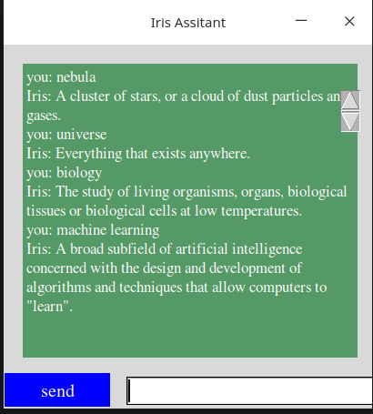

# [Knowledge based chatbot](https://kalebujordan.dev/)

This a cross-platform desktop app built with [tkinter] which simply acts like a dictionary chatbot, you can send it a message and it will return a response on what it thinks the message is by fetching it in a very large dictionary.

## Getting started

To get started with this app, you might have to clone or download the repository first;

```bash
git clone https://github.com/Kalebu/Desktop-chatbot-app
cd Desktop-chatbot-app
Desktop-chatbot-app->
```

## Dependencies

For Window user, there is no extra dependencies to be installed however for those in Linux or Mac sometimes Python does not come with Tkinter installed so you might have to install it manually;

```bash
sudo apt-get install python3-tk
```

## launching

Now once installed launch it by running as you would run a normal python script and the gui for chatbot will pop up;

```bash
python app.py
```

### launched interface

Your interface for the chatbot app will probably look like shown below;



## Issues

Are you facing any issue while trying to run the code, raise  one and I will be looking forward to fix it as soon as I can.

## Contributions

have something to add that will improve this projects, whether a documentation or codebase just fork it.

## Credits

ALl the credits to [Kalebu](https://github.com/Kalebu/)

### Where to find me ?

- [Personal Blog](https://kalebujordan.dev/)
- [Telegram](https://t.me/kalebujordan) 
- [LinkedIn](https://www.linkedin.com/in/kalebu-gwalugano/) 
- [Twitter](https://twitter.com/j_kalebu) 
- [Instagram](https://www.instagram.com/kalebu_jordan/) 
- [Facebook](https://web.facebook.com/kalebu.jordan)
- isaackeinstein(at)gmail.com
